# bamazon

## Overview

bamazon uses mySQL to create a inventory managment system. It has two different parts, one for the manager and one for the Customer. 

This uses a MySql Database called 'bamazon'
In then uses a Table called 'products'

The Database stores:
   * product_name (Name of product)
   * department_name
   * price (cost to customer)
   * stock_quantity (how much of the product is available in stores)
   * item_id (unique id for each product)

There is mock data saved in the seeds.sql file. 

The customer side: 
Displays a list of items in the inventory, takes in orders from customers and depletes stock from the store's inventory. 

- to see a list of what is in products are saved in the Database just run node bamazonCustomer.js in the terminal 
- This displays The item, The Department, the price, and the quanitity 

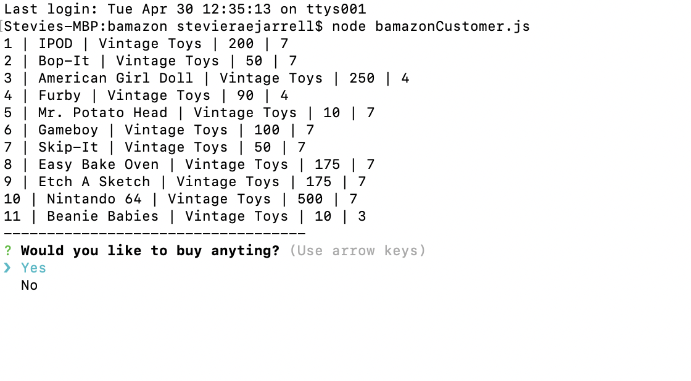

There is a prompt that asks if you want to buy anything. If no it exists. 
If you click yes it asks what you would like to buy.

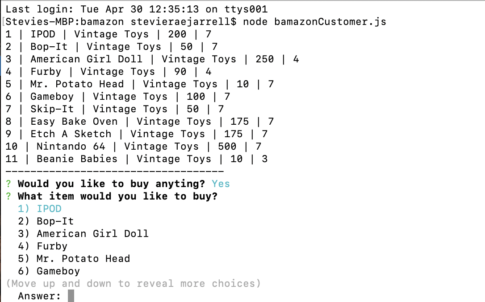

You can use the arrors or type in a number to choose the product. 

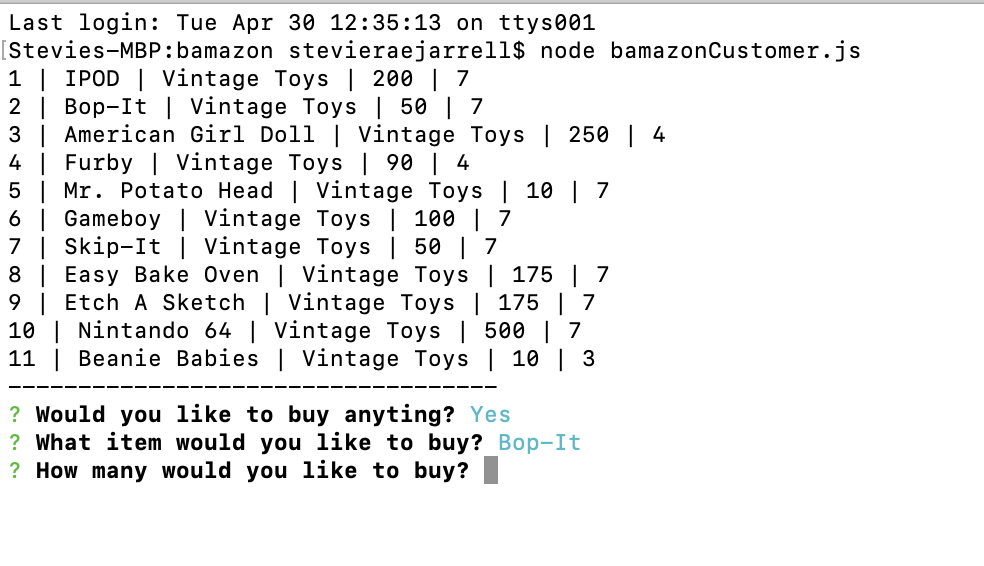

It will then display a message with how many you purchased and the cost. 

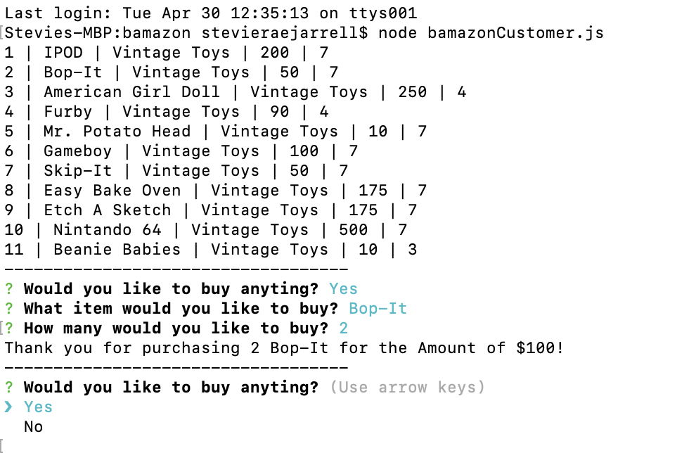

You can see that the SQL database reflects the product taken out of inventory. Bob-It went from 7 to 5. 

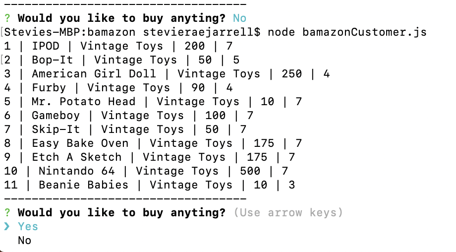

If the client trys to buy more then the inventory available. It will let them know.

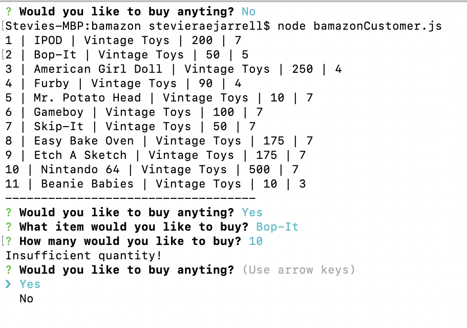

The Manager: 
Run node bamazonManager.js to see the manager section of bamazon

Displays multiple options 
 * View Products for Sale
 * View Low inventory
 * Add to Inventory
 * Add New Product

 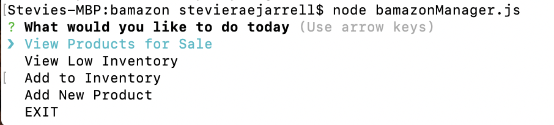

View Products for sale: 
- It will list every available item with their ID, name, prices, and quantities. I will Thank the Manager for coming and you can choose to do something else. 
 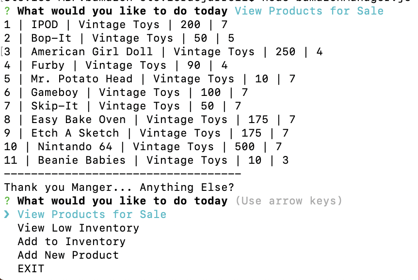

View Low Inventory: 
- This will show any inventory that has a count lower than five 
 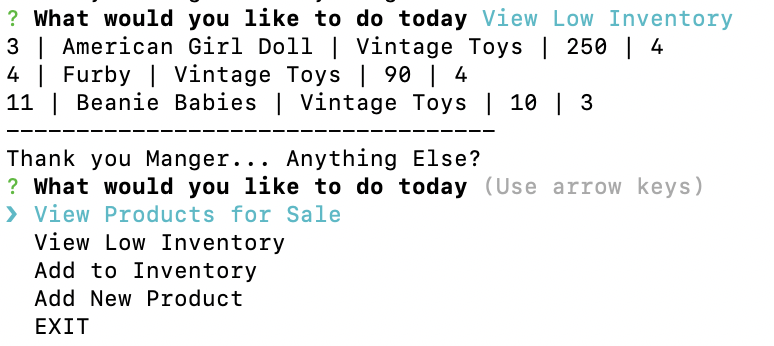

Add to Inventory: 
- This wil display a question asking which product you would like to add more inventory too. Use the arrow keys or enter the number. 
 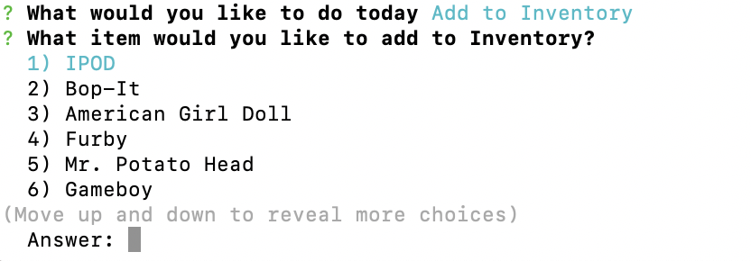
 - Once chosen it will ask how many you would like to add. 
  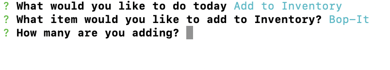
  - Then it will add that amount to the inventory and display how many you now have.
   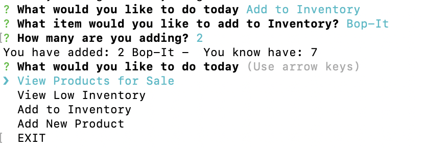

Add New Product: 
- This will take you to a set of prompts to add a new producct. It firsts asks the product name.
 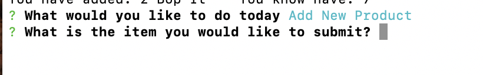
 - Then it will ask which Department store you would like to add it to.
 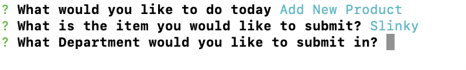
  - Then it will ask the amount of product you are adding
 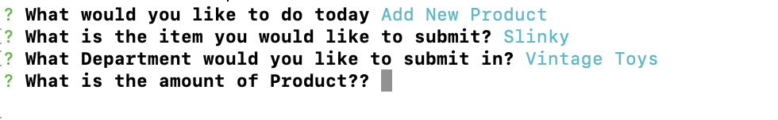
   - Finally it will ask you the price of the new product. 
 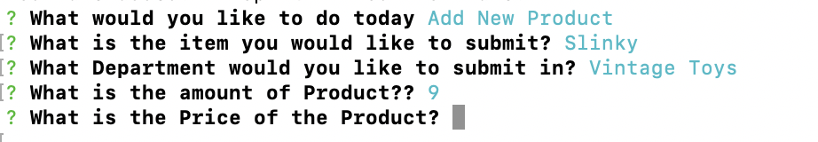
 - It will then display the new item that was successfully added.  
 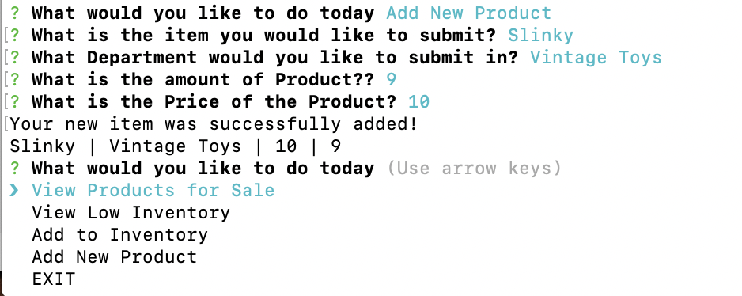

Updated Portfolio:
https://coloradosunrae.github.io/me/.